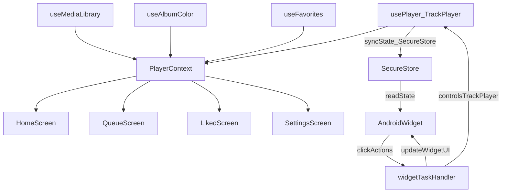

# Esei Tase — Improvement Plan

This document captures the current architecture (as implemented) and a prioritized sweep of improvements to increase build reliability, widget correctness, and overall maintainability.

## Current architecture (source of truth)

- **Navigation**: Expo Router (`app/`), with tabs in `app/(tabs)/_layout.tsx`.
- **Global state**: `src/context/PlayerContext.tsx` is the single source of truth for UI state (tracks, playback state, theme, settings).
- **Playback engine**: `react-native-track-player` via `src/hooks/usePlayer.ts` + background service in `src/service.ts` registered from `app/_layout.tsx`.
- **Dynamic theming**: `src/hooks/useAlbumColor.ts` derives a hex/rgba palette from album art and is exposed via context as `theme`.
- **Library scanning**: `src/hooks/useMediaLibrary.ts` reads device audio assets and progressively enriches metadata/artwork.
- **Android widget**: `react-native-android-widget` with render/task handler in `src/widgets/widget-task.tsx`. Widget UI is `src/widgets/MusicWidget.tsx`.

### Data flow

## Problems observed

- **Build fragility**: install-time patching can break EAS/CI unexpectedly.
- **Dual audio paths**: legacy `expo-audio` hook exists alongside TrackPlayer, increasing maintenance risk.
- **Widget action reliability**: mixed “direct control + command polling” patterns can double-trigger actions or cause state desync.
- **Sleep timer correctness**: using `togglePlay()` can start playback when it should pause.
- **Version correctness**: Settings hardcodes app version instead of using a single source of truth.
- **OTA comparison**: naive string inequality instead of semver-aware comparison.

## Prioritized changes

1. **Build reliability & dependency cleanup**
   - Remove unused legacy audio path (`src/hooks/useAudio.ts`) and unused dependency (`expo-audio`) if nothing imports it.
   - Keep installs deterministic (`npm ci`) and avoid install-time patching.

2. **Widget reliability**
   - Make widget actions **single-source-of-truth** (prefer direct TrackPlayer control in the widget task handler, and remove app-side command polling to avoid double execution).
   - Ensure widget UI is updated from TrackPlayer state after actions (title/artist/artwork/isPlaying).

3. **Audio correctness**
   - Add an explicit `pause()` API and use that for the sleep timer (never `togglePlay()`).
   - Prefer TrackPlayer events for `isPlaying` sync (avoid unnecessary optimistic flips).

4. **Product correctness**
   - Display app version from a single source of truth (`package.json` or Expo constants).
   - Use semver-aware OTA version comparison.

## Validation checklist

- **Install**: `npm ci` succeeds.
- **Lint**: `npm run lint` passes.
- **Runtime sanity (dev build)**:
  - Play/pause/seek/next/prev works.
  - Sleep timer always pauses playback.
  - Widget click does not double-trigger actions; widget reflects play state and track info.
  - Settings version matches package version.
  - OTA update check still works.

